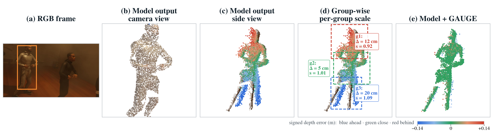
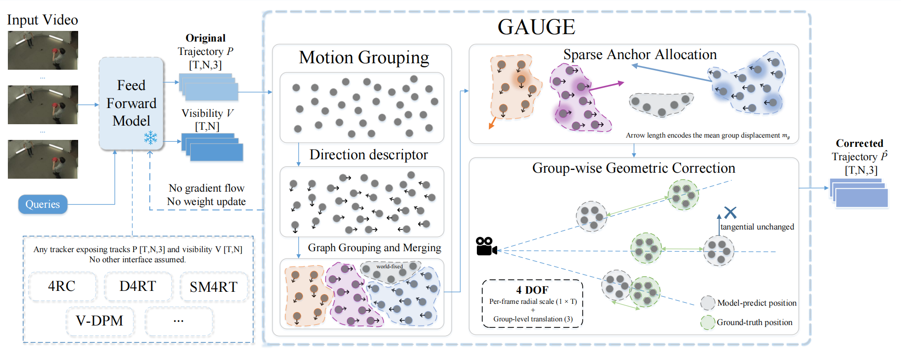
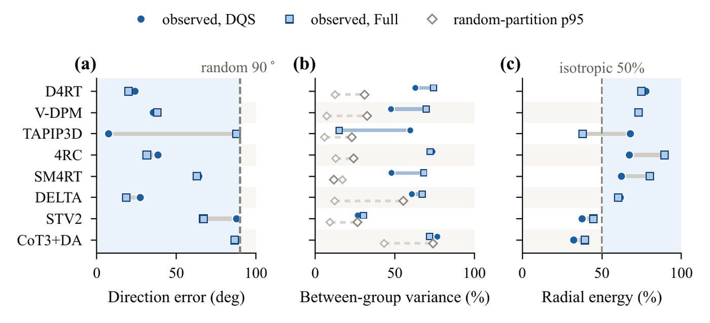
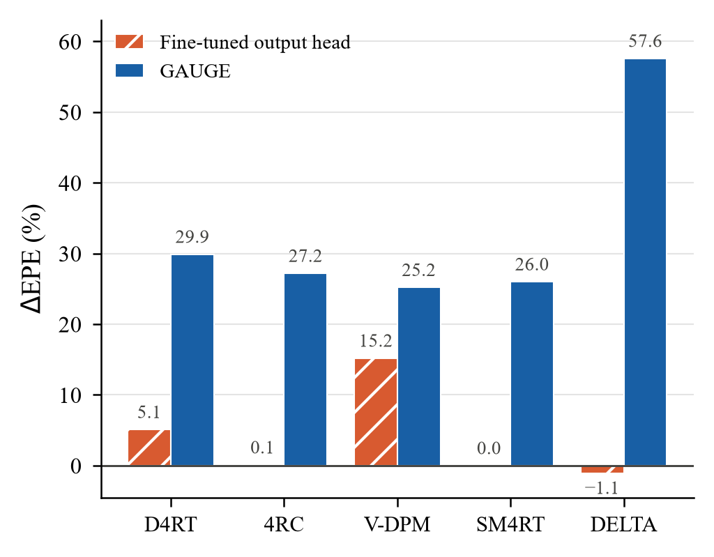
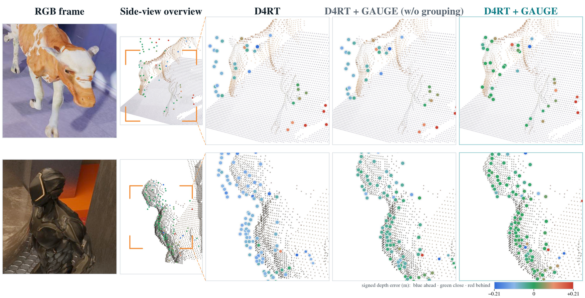
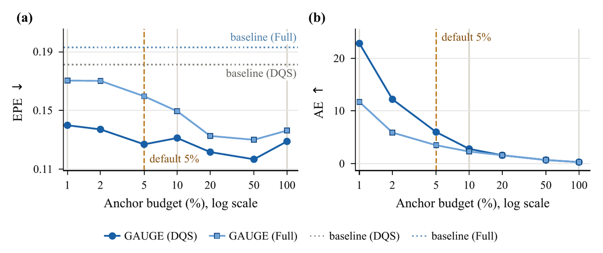

# GAUGE

**Group-Wise View-Inconsistency Rectification for Feed-Forward 4D Tracking**

[](LICENSE)
[](pyproject.toml)
[](requirements.txt)
[](https://arxiv.org/abs/2609.32596)



*The prediction looks accurate in the camera view (b), but seen from the side (c)
it carries a systematic depth bias along the view direction. Grouping recovers
that bias as a per-group radial scale (d), and GAUGE removes it (e).*

GAUGE is a training-free and model-agnostic post-hoc correction module for 3D point
trajectories. It takes the trajectories a feed-forward 4D tracker already
produces and returns corrected ones. No weight of the tracker is modified, no
gradient is computed, no optimizer is instantiated, and no GPU is needed: the
correction runs on CPU with `numpy` and `scipy` alone.



## Why the residual has a structure

After global alignment the residual of a feed-forward tracker is not isotropic
noise. On dynamic query points it concentrates along the view direction, and the
radial correction each motion group needs differs from group to group. Scaling a
point about the camera center leaves its projection unchanged, so the radial
distance to the camera carries a free degree of freedom per group and per frame
that no 2D observation can constrain. GAUGE estimates that family from a few
metric anchors and removes it.



## Highlights

- **Training-free and model-agnostic.** It is a post-hoc module on trajectories,
  so any tracker that outputs coordinates and visibility can use it.
- **`T + 3` degrees of freedom per group.** One radial scale about the camera
  center per frame, plus a single group-level translation, instead of one global
  scale factor for the whole sequence.
- **Very few anchors.** The metric anchors cover 1% to 5% of the query points and
  need not be precise.
- **On the benchmarks of the paper**, corrected endpoint error on dynamic query
  points drops by 15.1% to 62.6% across eight trackers. Spending the same anchors
  on gradient fine-tuning improves only -1.1% to 15.2%, measured on the five
  models whose pipelines admit that protocol.

## Results

Endpoint error and the two trajectory-accuracy metrics on the PointOdyssey test
split under dynamic query selection. Lower EPE is better; higher APD and AJ are
better. Values are from the paper.

| Model | EPE ↓ (base) | EPE ↓ (+GAUGE) | ΔEPE | APD ↑ (base → +GAUGE) | AJ ↑ (base → +GAUGE) |
| --- | --- | --- | --- | --- | --- |
| D4RT | 0.1812 | 0.1269 | **+29.9%** | 0.6877 → 0.7648 | 0.1038 → 0.1214 |
| 4RC | 0.1421 | 0.1035 | **+27.2%** | 0.7334 → 0.7832 | 0.0711 → 0.0892 |
| V-DPM | 0.1451 | 0.1086 | **+25.2%** | 0.7322 → 0.8091 | 0.1164 → 0.1164 |
| SM4RT | 0.1351 | 0.1000 | **+26.0%** | 0.7709 → 0.8010 | 0.0791 → 0.0851 |
| TAPIP3D | 0.1548 | 0.0966 | **+37.6%** | 0.7600 → 0.8365 | 0.1560 → 0.1576 |
| SpatialTrackerV2 | 2.0526 | 1.7428 | **+15.1%** | 0.0306 → 0.1164 | 0.0411 → 0.0521 |
| DELTA | 0.7013 | 0.2974 | **+57.6%** | 0.2867 → 0.5274 | 0.0700 → 0.1057 |
| CoTracker3+DA | 1.6050 | 0.5997 | **+62.6%** | 0.0496 → 0.3646 | 0.0344 → 0.0756 |

Spending the same anchors on gradient fine-tuning is a much weaker use of the
information. Fine-tuning the output head under the same anchor budget gives -1.1%
to 15.2%, against 25.2% to 57.6% for GAUGE, measured on the five models for which
that protocol applies.



Qualitatively, query points are coloured by signed depth error. Without grouping
the errors scatter ahead of and behind the surface, while GAUGE concentrates them.



## Installation

```bash
pip install -r requirements.txt
```

Python 3.9 or later. The only runtime dependencies are `numpy` and `scipy`. There
is no GPU requirement, no network access and no dataset download.

To install the package itself:

```bash
pip install -e .
```

## Quick start

```python
import numpy as np
from gauge import GAUGEConfig, apply_gauge

config = GAUGEConfig(target_anchor_frac=0.05)

corrected = apply_gauge(
    pred_m,        # [T, N, 3] predicted trajectories, world frame
    gt_m,          # [T, N, 3] metric ground truth, read where gt_valid is True
    pred_visible,  # [T, N]    bool, tracker-predicted visibility
    gt_valid,      # [T, N]    bool, the entries you actually measured
    centers,       # [T, 3]    per-frame camera center, same frame as pred_m
    config=config,
    seed=0,
)

assert corrected.shape == pred_m.shape
```

`apply_gauge_with_diagnostics` returns the same trajectories together with the
recovered groups, the per-group anchor counts and the number of groups that were
solved:

```python
from gauge import apply_gauge_with_diagnostics

corrected, diag = apply_gauge_with_diagnostics(...)
print(diag["n_groups_total"], diag["n_groups_solved"], diag["n_anchors_used"])
```

Two runnable examples are included. Neither needs a dataset, weights or a GPU:

```bash
python examples/quickstart.py      # end-to-end walkthrough on a synthetic sample
python examples/smoke_test.py      # self-check, exits non-zero on failure
```

## Adapting it to your own tracker

GAUGE works on trajectories, so the whole interface is five arrays.

| Argument | Shape | Meaning |
| --- | --- | --- |
| `pred_m` | `[T, N, 3]` | predicted trajectories, already aligned to the world frame |
| `pred_visible` | `[T, N]` bool | tracker-predicted visibility |
| `centers` | `[T, 3]` | per-frame camera center, in the same frame as `pred_m` |
| `gt_m` | `[T, N, 3]` | metric ground truth, read only where `gt_valid` is True |
| `gt_valid` | `[T, N]` bool | the entries where a metric observation exists |

Two helpers cover the parts that are easy to get wrong:

```python
from gauge import camera_centers_from_world_to_camera, make_anchor_arrays

# Most trackers and datasets give world-to-camera matrices, not centers.
centers = camera_centers_from_world_to_camera(extrinsics_w2c)   # [T, 3, 4] -> [T, 3]

# You do not need a dense metric ground truth: hand over the observations you
# have, for instance sparse LiDAR returns or SLAM keyframes.
gt_m, gt_valid = make_anchor_arrays(T, N, [(query, frame, x, y, z), ...])
```

Two points are worth stating explicitly, because they cause most of the
questions:

1. **`gt_m` is not a dense ground truth.** It is read only at the entries marked
   by `gt_valid`, and those entries are the candidate pool the anchors are drawn
   from. Everything else can be left unset, and `make_anchor_arrays` fills it
   with `NaN`. If you mark fewer observations than the budget asks for, the
   budget is capped at what you have and GAUGE warns you.
2. **The coordinates must already be globally aligned to a world frame.** GAUGE
   scales each group about the camera center, which is not defined in the camera
   frame. If the camera centers are all zero, GAUGE warns you explicitly rather
   than returning a plausible-looking wrong answer.

`docs/adapt_your_tracker.md` walks through both, including the checks
`gauge.validate_inputs` performs.

### Supplying your own groups

If you already have a segmentation or a motion clustering, pass it in and skip
the built-in grouping:

```python
corrected = apply_gauge(
    pred_m, gt_m, pred_visible, gt_valid, centers,
    groups=[
        {"group_type": "world_fixed", "indices": background_indices},
        {"group_type": "co_moving",   "indices": object_indices},
    ],
)
```

Each group needs `"indices"` and `"group_type"`, where the type is one of
`world_fixed`, `co_moving` and `independent_dynamic`. Points listed as
`independent_dynamic`, and points you leave out, keep their uncorrected
prediction. `gauge.validate_groups` checks the contract and rejects overlapping
groups with a readable error.

## How many anchors

The default budget is 5% of the query points. The curve below is the endpoint
error and the average accumulated per-anchor efficiency of D4RT on PointOdyssey;
the high-budget range saturates rather than degrades, so the choice of 5% rests
on per-anchor efficiency rather than on accuracy.



## Hyperparameters

`GAUGEConfig` carries all of them. The defaults are the configuration evaluated in
the paper.

| Field | Default | Meaning |
| --- | --- | --- |
| `target_anchor_frac` | 0.05 | anchor budget as a fraction of the query points |
| `default_form` | `scale_about_camera_per_frame_translation` | form used for co-moving groups |
| `world_fixed_form` | `scale_about_anchor_translation` | form used for world-fixed groups |
| `low_parallax_form` | `scale_about_anchor_translation` | form used for low-parallax groups |
| `parallax_threshold_deg` | 2.0 | groups below this median parallax use the anchor-centered form |
| `per_frame_scale_smooth_sigma` | 2.0 | Gaussian smoothing of the per-frame scale |
| `direction_cos_threshold` | 0.90 | mean cosine similarity required to link two points |
| `spatial_knn` | 10 | neighbourhood size of the spatial split |
| `direction_knn` | 50 | neighbours considered when building direction edges |

The full table, including the fewer-than-obvious ones such as
`world_fixed_spatial_knn`, is in [`docs/hyperparameters.md`](docs/hyperparameters.md).

## Documentation

| Document | Content |
| --- | --- |
| [`docs/method.md`](docs/method.md) | the three stages, the estimator of each, and the fallback chain |
| [`docs/hyperparameters.md`](docs/hyperparameters.md) | every field, its default and what it changes |
| [`docs/adapt_your_tracker.md`](docs/adapt_your_tracker.md) | the input contract, the coordinate frame and the common failure modes |

## Repository layout

```
gauge/
├── config.py      # GAUGEConfig
├── core.py        # apply_gauge, apply_gauge_with_diagnostics
├── grouping.py    # unsupervised motion grouping
├── anchors.py     # anchor budget allocation and sampling
├── transforms.py  # the low-degree-of-freedom geometric transforms
├── geometry.py    # per-query parallax proxy
└── adapt.py       # input validation and conversion helpers
examples/
├── quickstart.py            # walkthrough on a synthetic sample
├── smoke_test.py            # self-check
├── make_sample_sequence.py  # regenerates the sample
└── sample_sequence.npz      # the synthetic sample
docs/
```

## Reproducing the numbers in the paper

This repository is the correction module, and that is what it lets you reproduce:
given the trajectories of any tracker, you can run the correction and measure the
result with your own metrics. It does **not** ship the predictors, the datasets or
the cached predictions, so the endpoint errors reported in the paper additionally
require the following, none of which belongs in this repository:

- the trackers compared in the paper: D4RT, 4RC, V-DPM, SM4RT, TAPIP3D,
  SpatialTrackerV2, DELTA and CoTracker3, each a third-party project under its
  own license;
- the datasets: PointOdyssey, the WorldTrack release and TAPVid-3D;
- the evaluation metrics: end-point error, Average Percent of Points within Delta
  and 3D Average Jaccard follow the TAPVid-3D reference implementation.

## What this repository does not contain

Model weights, datasets, cached predictions, and the scripts that produced the
tables and figures of the paper.

The figures in this README are taken from the paper. `teaser.png`, `pipeline.png`
and `qualitative.jpg` contain sample frames from the evaluation datasets
(PointOdyssey and the WorldTrack release); they are reproduced here to illustrate
the method and remain subject to the terms of those datasets.

## Citation

```bibtex
@misc{feng2026gauge,
  title         = {GAUGE: Group-Wise View-Inconsistency Rectification for Feed-Forward 4D Tracking},
  author        = {Feng, Zhuoqian and Chen, Weixing and Chen, Ziliang and Liu, Yang and Lin, Liang},
  year          = {2026},
  eprint        = {2609.32596},
  archivePrefix = {arXiv},
  primaryClass  = {cs.CV},
  url           = {https://arxiv.org/abs/2609.32596}
}
```

## License

Apache-2.0. See [LICENSE](LICENSE).
